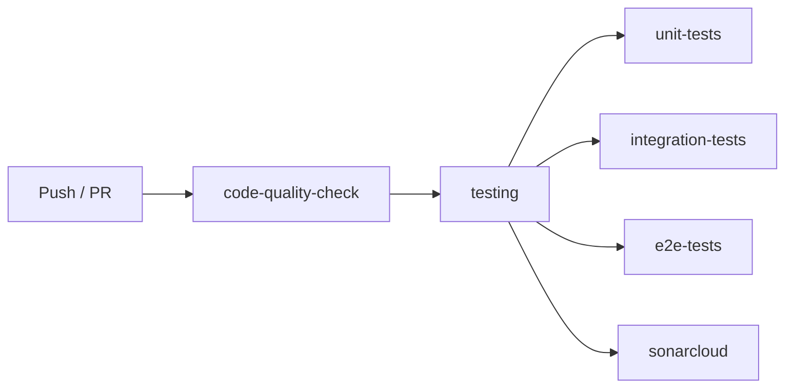

# async-task-manager

### SonarQuality:
[](https://sonarcloud.io/summary/new_code?id=vavilin-di_task_processor)

**Асинхронный сервис управления задачами** на базе FastAPI, RabbitMQ и PostgreSQL с реализацией паттерна **Transactional Outbox** для гарантированной доставки сообщений.

Версия: **0.1.0** · Python **3.12**

---

## Оглавление

- [Технологический стек](#технологический-стек)
- [Архитектура](#архитектура)
- [Быстрый старт](#быстрый-старт)
- [Структура проекта](#структура-проекта)
- [API](#api)
- [Makefile команды](#makefile-команды)
- [Docker](#docker)
- [CI/CD](#cicd)
- [Тестирование](#тестирование)
- [Документация](#документация)

---

## Технологический стек

| Категория             | Технологии                                                                                                                           |
| --------------------- | ------------------------------------------------------------------------------------------------------------------------------------ |
| **Веб-фреймворк**     | [FastAPI](https://fastapi.tiangolo.com/)                                                                                             |
| **ORM**               | [SQLAlchemy 2.x](https://www.sqlalchemy.org/) (async)                                                                                |
| **Миграции**          | [Alembic](https://alembic.sqlalchemy.org/)                                                                                           |
| **База данных**       | [PostgreSQL](https://www.postgresql.org/) ([asyncpg](https://github.com/MagicStack/asyncpg))                                         |
| **Брокер сообщений**  | [RabbitMQ](https://www.rabbitmq.com/) ([FastStream](https://faststream.airt.ai/))                                                    |
| **DI-контейнер**      | [Dishka](https://github.com/reagento/dishka)                                                                                         |
| **Валидация**         | [Pydantic v2](https://docs.pydantic.dev/) + [Pydantic-Settings](https://docs.pydantic.dev/latest/concepts/pydantic_settings/)        |
| **Пагинация**         | [sqlakeyset](https://github.com/djrobstep/sqlakeyset) (cursor-based)                                                                 |
| **Пакетный менеджер** | [uv](https://docs.astral.sh/uv/)                                                                                                     |
| **Тестирование**      | [pytest](https://docs.pytest.org/), [pytest-asyncio](https://pytest-asyncio.readthedocs.io/), [httpx](https://www.python-httpx.org/) |
| **Качество кода**     | [black](https://black.readthedocs.io/), [ruff](https://docs.astral.sh/ruff/), [mypy](https://mypy-lang.org/)                         |

---

## Архитектура


### Слои

```
┌─────────────────────────────────────────────────────────┐
│                    Routers (HTTP)                        │
│              FastAPI эндпоинты /api/v1/tasks             │
└───────────────────────┬─────────────────────────────────┘
                        │
┌───────────────────────▼─────────────────────────────────┐
│                    Services (Бизнес-логика)               │
│              TaskService · OutboxMessageService           │
└───────────────────────┬─────────────────────────────────┘
                        │
┌───────────────────────▼─────────────────────────────────┐
│                 Repositories (Data Access)                │
│   SQLAlchemyRepository · TaskRepository · OutboxMessage  │
│   DLQMessageRepository · SoftDeleteRepository            │
└───────────────────────┬─────────────────────────────────┘
                        │
┌───────────────────────▼─────────────────────────────────┐
│              Database Models (SQLAlchemy)                 │
│        Task · OutboxMessage · DLQMessage                 │
└─────────────────────────────────────────────────────────┘
```

### Паттерн Transactional Outbox

```mermaid
flowchart LR
    Client["Клиент (HTTP)"] -->|POST /tasks| API["FastAPI"]
    API -->|1. Создать задачу| DB[("PostgreSQL")]
    API -->|2. Запись в outbox (одна транзакция)| DB
    DB -->|3. Опрос outbox| Worker["Outbox Publisher"]
    Worker -->|4. Публикация| RMQ[("RabbitMQ")]
    RMQ -->|5. Обработка| Consumer["DLQ Consumer"]
    RMQ -->|6. Ошибка → DLX| DLQ["Dead-Letter Queue"]
    DLQ -->|7. Retry| Consumer
    Consumer -->|8. После 3 попыток| DBFail[("DLQMessage в БД")]

    style Client fill:#e1f5fe
    style API fill:#c8e6c9
    style DB fill:#fff9c4
    style Worker fill:#ffe0b2
    style RMQ fill:#f8bbd0
    style Consumer fill:#d1c4e9
    style DLQ fill:#ffcdd2
    style DBFail fill:#fff9c4
```

**Как это работает:**

1. При создании задачи в одной транзакции записываются данные в таблицы `tasks` и `outbox_messages`
2. **Outbox Publisher Worker** циклически опрашивает `outbox_messages` (каждые 0.5 с) и публикует неопубликованные сообщения в RabbitMQ
3. При успешной публикации сообщение помечается `is_published = true`
4. При ошибке увеличивается счётчик ошибок; после 5 ошибок — `is_failed = true`
5. **DLQ Consumer Worker** слушает dead-letter очередь и выполняет повторные попытки (до 3 раз с задержками 5/10/15 с)
6. После исчерпания попыток сообщение сохраняется в таблицу `dlq_messages`

### Модели данных

**Task**

| Поле          | Тип         | Описание                                                    |
| ------------- | ----------- | ----------------------------------------------------------- |
| `id`          | UUID        | Первичный ключ                                              |
| `name`        | String(255) | Название задачи                                             |
| `description` | Text        | Описание                                                    |
| `priority`    | Enum        | Low / Medium / High                                         |
| `status`      | Enum        | New / Pending / InProgress / Completed / Failed / Cancelled |
| `payload`     | JSON        | Произвольные данные                                         |
| `created_at`  | DateTime    | Дата создания                                               |
| `started_at`  | DateTime    | Дата начала                                                 |
| `finished_at` | DateTime    | Дата завершения                                             |
| `result`      | JSON        | Результат                                                   |
| `errors`      | JSON        | Ошибки                                                      |
| `is_active`   | Boolean     | Soft-delete                                                 |

**OutboxMessage**

| Поле           | Тип                          | Описание           |
| -------------- | ---------------------------- | ------------------ |
| `id`           | UUID                         | Первичный ключ     |
| `aggregate_id` | UUID (FK → tasks.id CASCADE) | ID задачи          |
| `routing_key`  | String                       | Ключ маршрутизации |
| `payload`      | JSON                         | Данные сообщения   |
| `is_published` | Boolean                      | Флаг публикации    |
| `is_failed`    | Boolean                      | Флаг ошибки        |
| `created_at`   | DateTime                     | Дата создания      |
| `errors`       | ARRAY(String)                | История ошибок     |

Индекс: `outbox_messages_not_published_idx` (`created_at` WHERE `is_published = false` AND `is_failed = false`)

**DLQMessage**

| Поле                   | Тип      | Описание            |
| ---------------------- | -------- | ------------------- |
| `id`                   | UUID     | Первичный ключ      |
| `original_routing_key` | String   | Исходный ключ       |
| `original_payload`     | JSON     | Исходные данные     |
| `error_type`           | String   | Тип ошибки          |
| `error_message`        | Text     | Сообщение об ошибке |
| `retry_count`          | Integer  | Количество попыток  |
| `x_death`              | JSON     | Метаданные RabbitMQ |
| `created_at`           | DateTime | Дата создания       |

### Очереди RabbitMQ

| Компонент               | Тип             | Назначение                                                  |
| ----------------------- | --------------- | ----------------------------------------------------------- |
| `tasks_exchange`        | direct, durable | Основной exchange                                           |
| `tasks_dlx`             | direct, durable | Dead-letter exchange                                        |
| `task_processing`       | queue           | Основная очередь (TTL 10 мин, max 10000, DLX → `tasks_dlx`) |
| `task_processing_dlq`   | queue           | Dead-letter очередь                                         |
| Временные retry-очереди | queue           | С TTL и auto-expire                                         |

### DI (Dishka)

| Провайдер            | Scope   | Компоненты              |
| -------------------- | ------- | ----------------------- |
| `SettingsProvider`   | APP     | Настройки приложения    |
| `BrokerProvider`     | APP     | RabbitMQ брокер         |
| `DatabaseProvider`   | APP     | Engine, session_factory |
| `RepositoryProvider` | REQUEST | Репозитории             |
| `ServiceProvider`    | REQUEST | Сервисы                 |

---

## Быстрый старт

### Предварительные требования

- Python 3.12
- [uv](https://docs.astral.sh/uv/#installation)
- PostgreSQL (локально или через Docker)
- RabbitMQ (локально или через Docker)

### Локальный запуск

```bash
# 1. Клонировать репозиторий
git clone <repo-url>
cd async-task-manager

# 2. Настроить переменные окружения
cp .env.example .env
# Отредактировать .env под своё окружение

# 3. Установить зависимости и применить миграции
make install

# 4. Запустить dev-сервер
make dev
```

Сервер будет доступен по адресу: `http://127.0.0.1:8080`

Документация API (Swagger): `http://127.0.0.1:8080/docs`

### Запуск воркеров

```bash
# Outbox Publisher Worker (в отдельном терминале)
make start_outbox_publish_worker

# DLQ Consumer Worker (в отдельном терминале)
make start_dlq_consumer_worker
```

---

## Структура проекта

```
async-task-manager/
├── src/
│   ├── __init__.py
│   ├── app.py                          # FastAPI приложение
│   ├── di.py                           # Dishka DI-контейнер
│   ├── enums.py                        # Перечисления (Priority, Status)
│   ├── database/
│   │   ├── migrations/                 # Alembic миграции
│   │   │   ├── env.py
│   │   │   ├── script.py.mako
│   │   │   └── versions/               # Файлы миграций
│   │   └── models/
│   │       ├── base.py                 # Базовый класс модели
│   │       ├── tasks.py                # Task модель
│   │       ├── outbox_messages.py      # OutboxMessage модель
│   │       └── dlq_messages.py         # DLQMessage модель
│   ├── messaging/
│   │   └── queues.py                   # Конфигурация RabbitMQ очередей
│   ├── repositories/
│   │   ├── sqlalchemy_repository.py    # Базовый CRUD репозиторий
│   │   ├── soft_delete_sqlalchemy_repository.py
│   │   ├── tasks.py                    # TaskRepository
│   │   ├── outbox_messages.py          # OutboxMessageRepository
│   │   └── dlq_messages.py             # DLQMessageRepository
│   ├── routers/
│   │   ├── __init__.py
│   │   └── tasks.py                    # HTTP эндпоинты
│   ├── schemas/
│   │   ├── common.py                   # Общие схемы (PaginatedResponse)
│   │   ├── tasks.py                    # TaskCreate, Task, TaskFilter
│   │   ├── outbox_messages.py          # OutboxMessageCreate
│   │   └── dlq_messages.py             # DLQMessageCreate
│   ├── services/
│   │   ├── tasks.py                    # TaskService
│   │   └── outbox_messages.py          # OutboxMessageService
│   ├── settings/
│   │   ├── __init__.py
│   │   ├── common.py                   # Базовые настройки
│   │   ├── postgres.py                 # PostgresSettings
│   │   ├── rabbit_mq.py                # RabbitMQSettings
│   │   └── settings.py                 # Settings (агрегатор)
│   └── workers/
│       ├── utilities.py                # Вспомогательные функции
│       ├── outbox_publisher/
│       │   ├── outbox_publish_worker.py
│       │   └── run_outbox_publish_worker.py
│       └── dlq_consumer/
│           ├── dlq_consumer_worker.py
│           └── run_dlq_consumer_worker.py
├── tests/
│   ├── conftest.py                     # Общие фикстуры
│   ├── unit/                           # Unit-тесты (~80%)
│   │   ├── test_enums.py
│   │   ├── test_schemas.py
│   │   ├── test_settings.py
│   │   ├── test_repositories/
│   │   │   ├── test_task_repository.py
│   │   │   └── test_outbox_repository.py
│   │   └── test_mq/
│   │       ├── test_utilities.py
│   │       └── test_outbox_message_service.py
│   ├── integration/                    # Integration-тесты (~20%)
│   │   ├── conftest.py
│   │   ├── test_sqlalchemy_repository.py
│   │   ├── test_task_repository.py
│   │   ├── test_outbox_repository.py
│   │   └── test_routers/
│   │       ├── conftest.py
│   │       └── test_tasks_router.py
│   └── e2e/
│       └── test_health_check.py
├── infrastructure/
│   ├── .dockerignore
│   ├── Dockerfile                      # Multi-stage сборка
│   └── docker-compose.yml              # Docker Compose
├── .github/
│   └── workflows/
│       ├── ci.yml                      # CI Pipeline
│       ├── code-quality-check.yml      # Black + Ruff + mypy
│       ├── testing.yml                 # Unit + Integration + E2E
│       └── sonarcloud.yml              # SonarCloud анализ
├── docs/
│   └── testing.md                      # Стратегия тестирования
├── pyproject.toml
├── Makefile
├── alembic.ini
├── sonar-project.properties
└── README.md
```

---

## API

Все эндпоинты доступны по префиксу `/api/v1/tasks`.

| Метод    | Путь                        | Описание                              | Статусы       |
| -------- | --------------------------- | ------------------------------------- | ------------- |
| `POST`   | `/api/v1/tasks`             | Создать задачу                        | `201`         |
| `GET`    | `/api/v1/tasks`             | Список задач (пагинация + фильтрация) | `200`         |
| `GET`    | `/api/v1/tasks/{id}`        | Получить задачу                       | `200` / `404` |
| `DELETE` | `/api/v1/tasks/{id}`        | Отменить задачу (soft-delete)         | `200` / `404` |
| `GET`    | `/api/v1/tasks/{id}/status` | Получить статус задачи                | `200` / `404` |

### Фильтрация

Параметры фильтрации для `GET /api/v1/tasks`:

| Параметр                              | Описание                |
| ------------------------------------- | ----------------------- |
| `name`                                | Поиск по названию       |
| `description`                         | Поиск по описанию       |
| `priority`                            | Фильтр по приоритету    |
| `status`                              | Фильтр по статусу       |
| `created_at_from` / `created_at_to`   | Диапазон дат создания   |
| `started_at_from` / `started_at_to`   | Диапазон дат начала     |
| `finished_at_from` / `finished_at_to` | Диапазон дат завершения |

Суффикс `_from` означает `>=`, суффикс `_to` означает `<=`.

Пагинация — **cursor-based** (через `sqlakeyset`).

---

## Makefile команды

| Команда                            | Описание                                                                |
| ---------------------------------- | ----------------------------------------------------------------------- |
| `make install`                     | Установка зависимостей (`uv sync`) + миграции                           |
| `make migrate`                     | Применить миграции (`alembic upgrade head`)                             |
| `make lint`                        | Проверка качества кода (black, ruff, mypy)                              |
| `make check_models`                | Проверка моделей (`alembic check`)                                      |
| `make dev`                         | Запуск dev-сервера с `--reload` (по умолчанию `127.0.0.1:8080`)         |
| `make start_main_app`              | Запуск production-сервера (с указанием `HOST`, `PORT`, `WORKERS_COUNT`) |
| `make start_outbox_publish_worker` | Запуск Outbox Publisher Worker                                          |
| `make start_dlq_consumer_worker`   | Запуск DLQ Consumer Worker                                              |
| `make test`                        | Запуск всех тестов                                                      |
| `make test_unit`                   | Запуск unit-тестов (маркер `unit`)                                      |
| `make test_integration`            | Запуск integration-тестов (маркер `integration`)                        |
| `make test_cov`                    | Запуск тестов с отчётом о покрытии                                      |

**Переменные:** `HOST` (по умолч. `127.0.0.1`), `PORT` (по умолч. `8080`), `WORKERS_COUNT` (по умолч. `1`).

---

## Docker

### Dockerfile

Multi-stage сборка:

1. **Builder** (`ghcr.io/astral-sh/uv:python3.12-bookworm-slim`) — установка зависимостей через `uv sync --no-dev --frozen`
2. **Runtime** (`python:3.12-slim-bookworm`) — копирование `.venv` и исходного кода, создание непривилегированного пользователя `app`

### Docker Compose

Сервисы в [`infrastructure/docker-compose.yml`](infrastructure/docker-compose.yml):

| Сервис                  | Назначение                          |
| ----------------------- | ----------------------------------- |
| `postgres`              | PostgreSQL 14.5                     |
| `rabbitmq`              | RabbitMQ 3.11 с management-плагином |
| `migration`             | Однократный запуск миграций Alembic |
| `app`                   | FastAPI приложение (uvicorn)        |
| `outbox-publish-worker` | Outbox Publisher Worker             |
| `dlq-consumer-worker`   | DLQ Consumer Worker                 |

```bash
# Запуск всех сервисов
docker compose -f infrastructure/docker-compose.yml up -d

# Просмотр логов
docker compose -f infrastructure/docker-compose.yml logs -f

# Остановка
docker compose -f infrastructure/docker-compose.yml down
```

---

## CI/CD

GitHub Actions пайплайн ([`.github/workflows/ci.yml`](.github/workflows/ci.yml)):



### Этапы

1. **code-quality-check** ([`.github/workflows/code-quality-check.yml`](.github/workflows/code-quality-check.yml))
   - `black --check --diff`
   - `ruff check`
   - `mypy`

2. **testing** ([`.github/workflows/testing.yml`](.github/workflows/testing.yml))
   - **unit-tests** — быстрые тесты без внешних зависимостей, с coverage
   - **integration-tests** — с PostgreSQL service container (postgres:14.5), с coverage
   - **e2e-tests** — smoke health-check, с PostgreSQL service container

3. **sonarcloud** ([`.github/workflows/sonarcloud.yml`](.github/workflows/sonarcloud.yml))
   - Анализ кода через SonarCloud
   - Требует `SONAR_TOKEN`

---

## Тестирование

Подробная стратегия тестирования описана в [`docs/testing.md`](docs/testing.md).

### Пирамида тестирования

```
        ╱╲
       ╱ E2E ╲           ← 1 сценарий (health-check)
      ╱────────╲
     ╱ Integration ╲     ← ~20% (репозитории + БД, роутеры)
    ╱────────────────╲
   ╱      Unit        ╲  ← ~80% (схемы, enums, репозитории с mock, утилиты)
  ╱──────────────────────╲
```

### Unit-тесты (~80%)

Быстрые, без внешних зависимостей. Покрывают:

- Схемы Pydantic — валидация, сериализация
- Перечисления (`StrEnum`)
- Репозитории (с замокированным `SQLAlchemyRepository`)
- Утилиты воркеров
- Outbox Worker (с замокированными `session`, `broker`, `repo`)
- Настройки — корректность построения URL

### Integration-тесты (~20%)

С реальной базой данных PostgreSQL через **testcontainers**:

- Полный CRUD через `SQLAlchemyRepository`
- `TaskRepository` — `cancel_task`, `get_task_status`
- `OutboxMessageRepository` — `get_not_published_task_ids`, `mark_task_as_published`, `add_error`
- HTTP-эндпоинты через `TestClient` FastAPI

### E2E

- Health-check приложения

### Запуск

```bash
# Все тесты
make test

# Unit-тесты
make test_unit

# Integration-тесты
make test_integration

# С отчётом о покрытии
make test_cov
```

---

## Документация

- [Стратегия тестирования](docs/testing.md) — подробное описание подходов, инструментов и структуры тестов

---

## Переменные окружения

Настройки приложения задаются через переменные окружения с префиксами:

| Префикс      | Назначение                 |
| ------------ | -------------------------- |
| `POSTGRES_*` | Подключение к PostgreSQL   |
| `RABBITMQ_*` | Подключение к RabbitMQ     |
| `APP_*`      | Общие настройки приложения |
| `CORS_*`     | CORS-политики              |

Основные переменные: `APP_TITLE`, `APP_VERSION`, `APP_ENV`, `DEBUG`, `LOG_LEVEL`, `API_PREFIX`, `API_VERSION_PREFIX`, `ALLOWED_HOSTS`, `CORS_ORIGINS`.