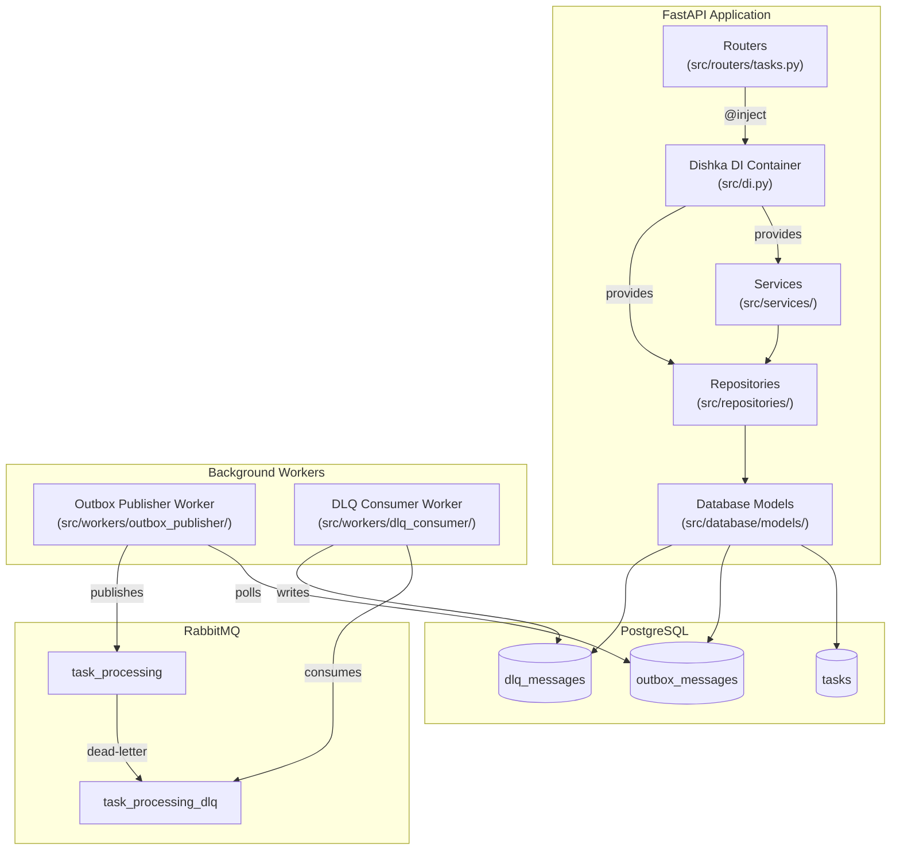
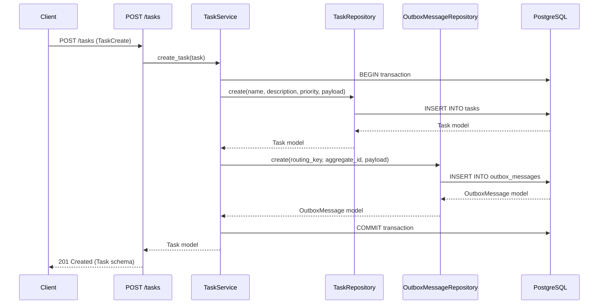
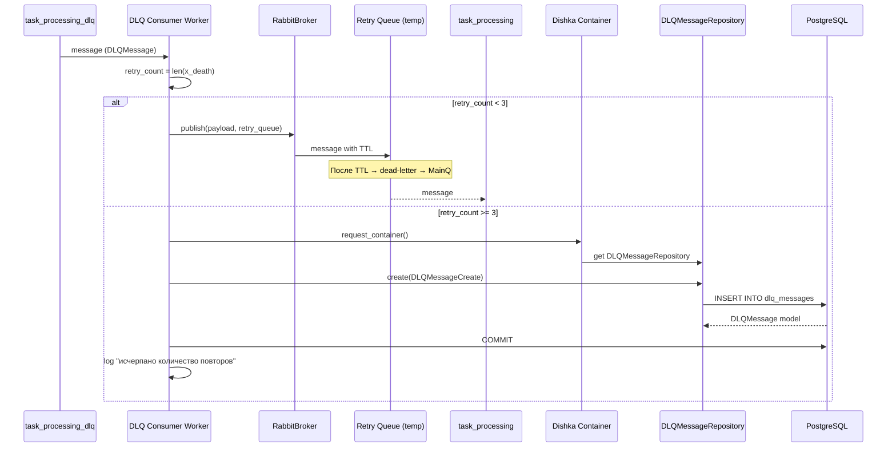

# Архитектура проекта async-task-manager

## 1. Общая архитектура

Проект представляет собой **асинхронный сервис управления задачами**, построенный на стеке **FastAPI + RabbitMQ + PostgreSQL** с применением паттерна **Transactional Outbox** для обеспечения надёжной доставки сообщений.

### Слои приложения

```
┌─────────────────────────────────────────────────────────────────────┐
│                        FastAPI Application                          │
│  ┌──────────────────────────────────────────────────────────────┐   │
│  │                     Routers (маршруты)                        │   │
│  │  ┌─────────────────────────────────────────────────────────┐ │   │
│  │  │              @inject (Dishka DI)                        │ │   │
│  │  └─────────────────────────────────────────────────────────┘ │   │
│  ├──────────────────────────────────────────────────────────────┤   │
│  │                     Services (бизнес-логика)                  │   │
│  │  ┌──────────────┐  ┌──────────────────────────────┐         │   │
│  │  │  TaskService  │  │  OutboxMessageService        │         │   │
│  │  └──────────────┘  └──────────────────────────────┘         │   │
│  ├──────────────────────────────────────────────────────────────┤   │
│  │                   Repositories (доступ к данным)              │   │
│  │  ┌──────────────┐  ┌──────────────────┐  ┌───────────────┐  │   │
│  │  │TaskRepository │  │OutboxMessageRepo │  │DLQMessageRepo │  │   │
│  │  └──────┬───────┘  └──────────────────┘  └───────────────┘  │   │
│  │         │                                                     │   │
│  │  ┌──────┴──────────────────────────────────────────────────┐  │   │
│  │  │       SoftDeleteSQLAlchemyRepository                    │  │   │
│  │  └──────┬──────────────────────────────────────────────────┘  │   │
│  │         │                                                     │   │
│  │  ┌──────┴──────────────────────────────────────────────────┐  │   │
│  │  │            SQLAlchemyRepository (Generic CRUD)           │  │   │
│  │  └─────────────────────────────────────────────────────────┘  │   │
│  ├──────────────────────────────────────────────────────────────┤   │
│  │              Database Models (SQLAlchemy ORM)                 │   │
│  │  ┌──────────┐  ┌────────────────┐  ┌────────────────────┐   │   │
│  │  │   Task    │  │ OutboxMessage  │  │    DLQMessage      │   │   │
│  │  └──────────┘  └────────────────┘  └────────────────────┘   │   │
│  └──────────────────────────────────────────────────────────────┘   │
└─────────────────────────────────────────────────────────────────────┘
                           │
                           ▼
┌─────────────────────────────────────────────────────────────────────┐
│                         PostgreSQL                                   │
│  ┌──────────┐  ┌────────────────┐  ┌────────────────────┐         │
│  │  tasks   │  │ outbox_messages │  │   dlq_messages     │         │
│  └──────────┘  └────────────────┘  └────────────────────┘         │
└─────────────────────────────────────────────────────────────────────┘

┌─────────────────────────────────────────────────────────────────────┐
│                     Фоновые воркеры                                  │
│  ┌─────────────────────────────────────┐                           │
│  │     Outbox Publisher Worker         │                           │
│  │  (читает outbox, публикует в RMQ)   │                           │
│  └──────────────┬──────────────────────┘                           │
│                 │                                                  │
│                 ▼                                                  │
│  ┌─────────────────────────────────────┐                           │
│  │          RabbitMQ                    │                           │
│  │  ┌──────────────┐  ┌──────────────┐ │                           │
│  │  │task_processing│  │task_processing│ │                          │
│  │  │              │  │    _dlq      │ │                           │
│  │  └──────────────┘  └──────┬───────┘ │                           │
│  └───────────────────────────┼─────────┘                           │
│                              │                                      │
│  ┌───────────────────────────┴──────────────────────┐              │
│  │          DLQ Consumer Worker                      │              │
│  │  (читает DLQ, retry или запись в БД)              │              │
│  └───────────────────────────────────────────────────┘              │
└─────────────────────────────────────────────────────────────────────┘
```

### DI-контейнер (Dishka)

Все слои приложения связываются через **Dishka** — контейнер внедрения зависимостей. Провайдеры разделены по скоупам:

| Провайдер                                      | Скоуп     | Компоненты                                                                                                          |
| ---------------------------------------------- | --------- | ------------------------------------------------------------------------------------------------------------------- |
| [`SettingsProvider`](src/di.py:69)             | `APP`     | [`Settings`](src/settings/settings.py)                                                                              |
| [`BrokerProvider`](src/di.py:63)               | `APP`     | [`RabbitBroker`](src/di.py:66)                                                                                      |
| [`DatabaseProvider`](src/di.py:19)             | `APP`     | [`engine`](src/di.py:22), [`session_factory`](src/di.py:26)                                                         |
| [`DatabaseProvider.get_session`](src/di.py:29) | `REQUEST` | [`AsyncSession`](src/di.py:30)                                                                                      |
| [`RepositoryProvider`](src/di.py:35)           | `REQUEST` | [`TaskRepository`](src/di.py:37), [`OutboxMessageRepository`](src/di.py:41), [`DLQMessageRepository`](src/di.py:45) |
| [`ServiceProvider`](src/di.py:49)              | `REQUEST` | [`TaskService`](src/di.py:51), [`OutboxMessageService`](src/di.py:57)                                               |

---

## 2. Слой маршрутизации (routers/)

Файл: [`src/routers/tasks.py`](src/routers/tasks.py)

Эндпоинты CRUD для задач:

| Метод    | Путь                      | Описание                           |
| -------- | ------------------------- | ---------------------------------- |
| `POST`   | `/tasks`                  | Создание задачи                    |
| `GET`    | `/tasks`                  | Список задач (курсорная пагинация) |
| `GET`    | `/tasks/{task_id}`        | Получение задачи по ID             |
| `DELETE` | `/tasks/{task_id}`        | Отмена задачи (soft-delete)        |
| `GET`    | `/tasks/{task_id}/status` | Получение статуса задачи           |

Все хендлеры используют декоратор [`@inject`](src/routers/tasks.py:24) из Dishka для автоматического внедрения зависимостей через `FromDishka[TaskService]`.

Валидация запросов и ответов выполняется через Pydantic-схемы: [`TaskCreate`](src/schemas/tasks.py:12), [`Task`](src/schemas/tasks.py:21), [`TaskFilter`](src/schemas/tasks.py:37), [`PaginatedResponse`](src/schemas/common.py:4).

---

## 3. Слой сервисов (services/)

### [`TaskService`](src/services/tasks.py:19)

Бизнес-логика управления задачами:

- **`create_task`** ([`src/services/tasks.py:27`](src/services/tasks.py:27)) — в одной транзакции создаёт задачу в таблице `tasks` и outbox-сообщение в таблице `outbox_messages`. Транзакция обеспечивает атомарность: либо сохраняются оба объекта, либо ни один.
- **`get_tasks`** ([`src/services/tasks.py:36`](src/services/tasks.py:36)) — получение списка задач с курсорной пагинацией и фильтрацией.
- **`get_task`** ([`src/services/tasks.py:47`](src/services/tasks.py:47)) — получение задачи по ID.
- **`cancel_task`** ([`src/services/tasks.py:50`](src/services/tasks.py:50)) — отмена задачи (soft-delete + установка статуса `CANCELLED`).
- **`get_task_status`** ([`src/services/tasks.py:53`](src/services/tasks.py:53)) — получение только статуса задачи (оптимизированный запрос без загрузки всей модели).

### [`OutboxMessageService`](src/services/outbox_messages.py:12)

Сервис публикации outbox-сообщений:

- **`publish_batch`** ([`src/services/outbox_messages.py:21`](src/services/outbox_messages.py:21)) — получает пачку неопубликованных сообщений из БД, публикует каждое в RabbitMQ, помечает успешно опубликованные как `is_published=true`. При ошибках публикации логирует ошибку и добавляет запись в массив `errors` через `add_error`.

---

## 4. Слой репозиториев (repositories/)

### [`SQLAlchemyRepository`](src/repositories/sqlalchemy_repository.py:19)

Generic CRUD-репозиторий с поддержкой:

| Метод                                                       | Описание                                         |
| ----------------------------------------------------------- | ------------------------------------------------ |
| [`create`](src/repositories/sqlalchemy_repository.py:24)    | Создание записи                                  |
| [`get`](src/repositories/sqlalchemy_repository.py:31)       | Получение по ID                                  |
| [`exists`](src/repositories/sqlalchemy_repository.py:35)    | Проверка существования                           |
| [`get_all`](src/repositories/sqlalchemy_repository.py:39)   | Список с курсорной пагинацией через `sqlakeyset` |
| [`get_value`](src/repositories/sqlalchemy_repository.py:48) | Получение одного поля                            |
| [`update`](src/repositories/sqlalchemy_repository.py:54)    | Обновление с `RETURNING`                         |
| [`delete`](src/repositories/sqlalchemy_repository.py:65)    | Физическое удаление                              |

**Фильтрация** ([`src/repositories/sqlalchemy_repository.py:75`](src/repositories/sqlalchemy_repository.py:75)): поддерживаются суффиксы `_from` (оператор `>=`) и `_to` (оператор `<=`) для диапазонных фильтров. Без суффикса — оператор `=`.

### [`SoftDeleteSQLAlchemyRepository`](src/repositories/soft_delete_sqlalchemy_repository.py:14)

Наследует [`SQLAlchemyRepository`](src/repositories/sqlalchemy_repository.py:19), переопределяет:

- [`delete`](src/repositories/soft_delete_sqlalchemy_repository.py:16) — вместо `DELETE` выполняет `UPDATE is_active=False`
- [`_get_base_record_filter`](src/repositories/soft_delete_sqlalchemy_repository.py:21) — добавляет условие `AND is_active=true`
- [`_get_base_get_all_select_statement`](src/repositories/soft_delete_sqlalchemy_repository.py:25) — добавляет `WHERE is_active=true`

### [`TaskRepository`](src/repositories/tasks.py:7)

Наследует [`SoftDeleteSQLAlchemyRepository[Task]`](src/repositories/soft_delete_sqlalchemy_repository.py:14):

- [`cancel_task`](src/repositories/tasks.py:8) — обновляет статус на `CANCELLED`
- [`get_task_status`](src/repositories/tasks.py:11) — получает только поле `status`

### [`OutboxMessageRepository`](src/repositories/outbox_messages.py:13)

Наследует [`SQLAlchemyRepository[OutboxMessage]`](src/repositories/sqlalchemy_repository.py:19):

- [`get_not_published_outbox_messages`](src/repositories/outbox_messages.py:14) — выбирает неопубликованные и не упавшие сообщения с `FOR UPDATE SKIP LOCKED`, streaming-режимом и лимитом. Возвращает `AsyncGenerator`.
- [`mark_messages_as_published`](src/repositories/outbox_messages.py:28) — batch-обновление `is_published=true` для списка ID.
- [`add_error`](src/repositories/outbox_messages.py:34) — добавляет ошибку в массив `errors` через `array_append`. При достижении 5 ошибок устанавливает `is_failed=true`.

### [`DLQMessageRepository`](src/repositories/dlq_messages.py:6)

Наследует [`SQLAlchemyRepository[DLQMessageModel]`](src/repositories/sqlalchemy_repository.py:19). Без дополнительных методов.

---

## 5. Модели данных (database/models/)

### [`Base`](src/database/models/base.py:6)

Базовый класс для всех моделей — `DeclarativeBase`.

### [`Task`](src/database/models/tasks.py:15)

Таблица `tasks`:

| Поле          | Тип         | Описание                                                                    |
| ------------- | ----------- | --------------------------------------------------------------------------- |
| `id`          | `int PK`    | Первичный ключ                                                              |
| `name`        | `str`       | Название задачи                                                             |
| `description` | `str`       | Описание                                                                    |
| `priority`    | `StrEnum`   | Приоритет: `LOW`, `MEDIUM`, `HIGH`                                          |
| `status`      | `StrEnum`   | Статус: `NEW`, `PENDING`, `IN_PROGRESS`, `COMPLETED`, `FAILED`, `CANCELLED` |
| `payload`     | `JSON`      | Произвольные данные задачи                                                  |
| `created_at`  | `DateTime`  | Дата создания                                                               |
| `started_at`  | `DateTime?` | Дата начала обработки                                                       |
| `finished_at` | `DateTime?` | Дата завершения                                                             |
| `result`      | `JSON?`     | Результат выполнения                                                        |
| `errors`      | `JSON?`     | Ошибки выполнения                                                           |
| `is_active`   | `bool`      | Флаг soft-delete (по умолчанию `true`)                                      |

### [`OutboxMessage`](src/database/models/outbox_messages.py:14)

Таблица `outbox_messages`:

| Поле           | Тип                         | Описание                               |
| -------------- | --------------------------- | -------------------------------------- |
| `id`           | `int PK`                    | Первичный ключ                         |
| `aggregate_id` | `int FK → tasks.id CASCADE` | ID связанной задачи                    |
| `routing_key`  | `str`                       | Ключ маршрутизации RabbitMQ            |
| `payload`      | `JSON`                      | Данные для публикации                  |
| `is_published` | `bool`                      | Флаг публикации (по умолчанию `false`) |
| `is_failed`    | `bool`                      | Флаг ошибки (по умолчанию `false`)     |
| `created_at`   | `DateTime`                  | Дата создания                          |
| `errors`       | `ARRAY(String)`             | Массив ошибок публикации               |

**Индекс**: [`outbox_messages_not_published_idx`](src/database/models/outbox_messages.py:18) — partial index `WHERE is_published=false AND is_failed=false` для эффективного поиска неопубликованных сообщений.

### [`DLQMessage`](src/database/models/dlq_messages.py:14)

Таблица `dlq_messages`:

| Поле                   | Тип        | Описание                   |
| ---------------------- | ---------- | -------------------------- |
| `id`                   | `int PK`   | Первичный ключ             |
| `original_routing_key` | `str`      | Исходный routing key       |
| `original_payload`     | `JSON`     | Исходные данные            |
| `error_type`           | `str?`     | Тип ошибки                 |
| `error_message`        | `str`      | Сообщение об ошибке        |
| `retry_count`          | `int`      | Количество попыток         |
| `x_death`              | `JSON?`    | Метаданные DLQ из RabbitMQ |
| `created_at`           | `DateTime` | Дата создания              |

---

## 6. Схемы Pydantic (schemas/)

### [`PaginatedResponse[T]`](src/schemas/common.py:4)

Generic-схема для курсорной пагинации:

```python
class PaginatedResponse[T](BaseModel):
    items: list[T]        # Элементы текущей страницы
    next_cursor: str | None  # Курсор для следующей страницы
    has_next: bool        # Есть ли следующая страница
```

### [`TaskCreate`](src/schemas/tasks.py:12)

Схема создания задачи: `name`, `description`, `priority` (по умолчанию `MEDIUM`), `payload`.

### [`Task`](src/schemas/tasks.py:21)

Схема задачи для ответа: все поля модели, включая `id`, `status`, `created_at`, `is_active`.

### [`TaskFilter`](src/schemas/tasks.py:37)

Схема фильтрации с диапазонными полями: `created_at_from`/`created_at_to`, `started_at_from`/`started_at_to`, `finished_at_from`/`finished_at_to`, а также `name`, `description`, `priority`, `status`.

### [`OutboxMessageCreate`](src/schemas/outbox_messages.py:7)

Схема создания outbox-сообщения: `routing_key`, `aggregate_id`, `payload`.

### [`OutboxMessage`](src/schemas/outbox_messages.py:15)

Схема outbox-сообщения для ответа: `id`, `routing_key`, `payload`.

### [`DLQMessageCreate`](src/schemas/dlq_messages.py:8)

Схема создания DLQ-сообщения: `original_routing_key`, `original_payload`, `error_type`, `error_message`, `retry_count`, `x_death`.

### [`DLQMessage`](src/schemas/dlq_messages.py:19)

Схема DLQ-сообщения для ответа: все поля + `created_at`.

---

## 7. DI-контейнер (Dishka)

Файл: [`src/di.py`](src/di.py)

Контейнер собирается функцией [`create_di_container`](src/di.py:75) из пяти провайдеров:

```python
def create_di_container() -> AsyncContainer:
    return make_async_container(
        SettingsProvider(), BrokerProvider(), DatabaseProvider(),
        RepositoryProvider(), ServiceProvider()
    )
```

**Скоуп `APP`** (создаётся один раз при старте приложения):
- [`Settings`](src/di.py:71) — настройки приложения
- [`AsyncEngine`](src/di.py:22) — движок SQLAlchemy
- [`async_sessionmaker`](src/di.py:26) — фабрика сессий
- [`RabbitBroker`](src/di.py:66) — брокер RabbitMQ

**Скоуп `REQUEST`** (создаётся на каждый запрос/итерацию воркера):
- [`AsyncSession`](src/di.py:30) — сессия БД
- Репозитории: [`TaskRepository`](src/di.py:37), [`OutboxMessageRepository`](src/di.py:41), [`DLQMessageRepository`](src/di.py:45)
- Сервисы: [`TaskService`](src/di.py:51), [`OutboxMessageService`](src/di.py:57)

---

## 8. Обработка ошибок

Файл: [`src/app.py`](src/app.py)

Глобальный обработчик исключений:

- [`IntegrityError`](src/app.py:25) → HTTP `409 Conflict` с сообщением *«Конфликт данных. Возможно, связанная запись была удалена.»*

Dishka интегрируется с FastAPI через [`setup_dishka`](src/app.py:22).

---

## 9. Mermaid-диаграммы

### 9.1. Диаграмма слоёв приложения



### 9.2. Диаграмма потока создания задачи



### 9.3. Диаграмма работы Outbox Publisher Worker

```mermaid
sequenceDiagram
    participant Worker as Outbox Publisher Worker
    participant Container as Dishka Container
    participant OutboxSvc as OutboxMessageService
    participant OutboxRepo as OutboxMessageRepository
    participant DB as PostgreSQL
    participant Broker as RabbitBroker
    participant Queue as task_processing

    loop Каждые poll_interval секунд
        Worker->>Container: request_container()
        Container->>OutboxSvc: get OutboxMessageService
        OutboxSvc->>OutboxRepo: get_not_published_outbox_messages(limit=10)
        OutboxRepo->>DB: SELECT ... FOR UPDATE SKIP LOCKED
        DB-->>OutboxRepo: AsyncGenerator[(id, routing_key, payload)]

        loop Каждое сообщение
            OutboxSvc->>Broker: publish(payload, queue, routing_key)
            alt Успешно
                Broker->>Queue: message
                OutboxSvc->>OutboxRepo: mark_messages_as_published([id])
            except Ошибка
                OutboxSvc->>OutboxRepo: add_error(id, error_message)
                OutboxRepo->>DB: array_append(errors, error)
                Note over OutboxRepo: Если errors >= 5 → is_failed=true
            end
        end

        OutboxRepo->>DB: UPDATE is_published=true
        OutboxSvc-->>Worker: batch completed
        Worker->>Worker: sleep(poll_interval)
    end
```

### 9.4. Диаграмма работы DLQ Consumer Worker



---

## 10. Конфигурация очередей RabbitMQ

Файл: [`src/messaging/queues.py`](src/messaging/queues.py)

| Компонент        | Имя                   | Описание                                  |
| ---------------- | --------------------- | ----------------------------------------- |
| Exchange         | `tasks_exchange`      | Основной exchange (DIRECT, durable)       |
| DLX Exchange     | `tasks_dlx`           | Dead-letter exchange (DIRECT, durable)    |
| Основная очередь | `task_processing`     | Обработка задач, routing key `process`    |
| DLQ очередь      | `task_processing_dlq` | Dead-letter очередь, routing key `failed` |

**Параметры основной очереди**:
- `x-dead-letter-exchange`: `tasks_dlx`
- `x-dead-letter-routing-key`: `failed`
- `x-message-ttl`: 600 000 мс (10 минут)
- `x-max-length`: 10 000 сообщений

**Retry-механизм** ([`get_retry_queue`](src/messaging/queues.py:34)):
- Создаётся временная очередь с TTL = `delay_ms`
- После истечения TTL сообщение через dead-letter возвращается в основную очередь
- Очередь самоуничтожается через `delay_ms + 10 000 мс`

---

## 11. Перечисления (enums)

Файл: [`src/enums.py`](src/enums.py)

### [`TaskStatus`](src/enums.py:4)

```python
class TaskStatus(StrEnum):
    NEW = "Новая задача"
    PENDING = "Ожидает обработки"
    IN_PROGRESS = "В процессе выполнения"
    COMPLETED = "Завершена успешно"
    FAILED = "Завершена с ошибкой"
    CANCELLED = "Отменена"
```

### [`TaskPriority`](src/enums.py:13)

```python
class TaskPriority(StrEnum):
    LOW = "Низкий"
    MEDIUM = "Средний"
    HIGH = "Высокий"
```

---

## 12. Ключевые архитектурные решения

1. **Transactional Outbox** — гарантирует, что сообщение в RabbitMQ будет отправлено только после успешного сохранения задачи в БД. Задача и outbox-сообщение создаются в одной транзакции.

2. **Курсорная пагинация** — через библиотеку `sqlakeyset` с использованием курсора вместо `OFFSET/LIMIT` для стабильной пагинации при активной вставке записей.

3. **Soft-delete** — задачи не удаляются физически, а помечаются `is_active=false`. Все запросы по умолчанию фильтруют только активные записи.

4. **FOR UPDATE SKIP LOCKED** — воркер Outbox Publisher использует блокировку строк на уровне БД для безопасной конкурентной обработки сообщений несколькими экземплярами воркера.

5. **Dead Letter Queue с retry** — сообщения, не обработанные за TTL, попадают в DLQ. DLQ Consumer Worker пытается повторить обработку до 3 раз с увеличивающейся задержкой, после чего сохраняет сообщение в таблицу `dlq_messages`.

6. **Dishka DI** — контейнер внедрения зависимостей с разделением на `APP` и `REQUEST` скоупы. Обеспечивает правильное управление жизненным циклом сессий БД и соединений с RabbitMQ.