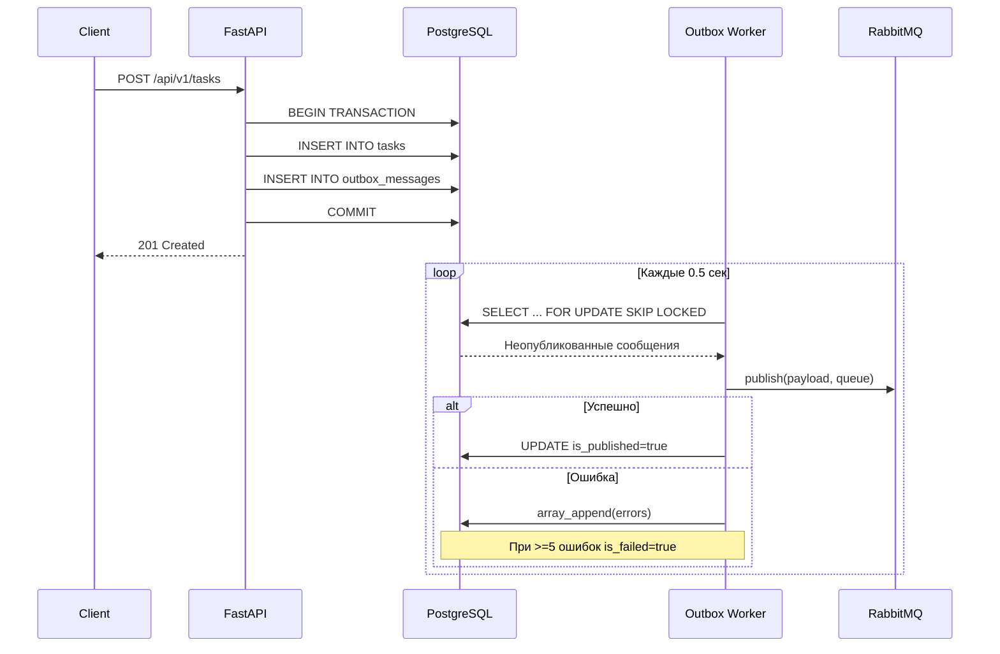

# Transactional Outbox Pattern

## 1. Что такое Transactional Outbox

**Проблема:** В микросервисной архитектуре при использовании двух разных хранилищ (база данных + брокер сообщений) невозможно гарантировать атомарность записи бизнес-данных и отправки сообщения. Если после сохранения данных в БД произойдёт сбой перед отправкой в RabbitMQ — сообщение будет потеряно. Если отправить сообщение до коммита транзакции — потребитель может прочитать ещё не зафиксированные данные.

**Решение:** Паттерн **Transactional Outbox** решает эту проблему следующим образом:

- Сообщение для брокера записывается в ту же базу данных, в той же транзакции, что и бизнес-данные.
- Отдельный фоновый воркер (Outbox Publisher Worker) периодически читает неопубликованные сообщения из таблицы `outbox_messages` и публикует их в брокер.
- После успешной публикации сообщение помечается как опубликованное (`is_published = true`).

Таким образом достигается **гарантированная доставка** (at-least-once delivery): сообщение не будет потеряно, даже если RabbitMQ временно недоступен.

---

## 2. Реализация в проекте

### 2.1. Модель OutboxMessage

Модель SQLAlchemy для таблицы `outbox_messages`:

- **Таблица:** `outbox_messages`
- **Поля:**
  - `id` — первичный ключ (SERIAL)
  - `aggregate_id` — внешний ключ на `tasks(id)` с `ON DELETE CASCADE`
  - `routing_key` — ключ маршрутизации для RabbitMQ (например, `tasks.create`)
  - `payload` — тело сообщения в формате JSON
  - `is_published` — флаг успешной публикации (по умолчанию `false`)
  - `is_failed` — флаг, что сообщение упало после превышения лимита ошибок (по умолчанию `false`)
  - `created_at` — временная метка создания
  - `errors` — массив строк с описанием ошибок публикации

**Partial index:** `outbox_messages_not_published_idx` на `created_at` с условием `WHERE is_published = false AND is_failed = false`. Этот индекс обеспечивает быструю выборку неопубликованных и не упавших сообщений.

**Ссылка:** [`src/database/models/outbox_messages.py`](src/database/models/outbox_messages.py)

---

### 2.2. Создание outbox-сообщения

В сервисе задач [`src/services/tasks.py`](src/services/tasks.py) метод `create_task` создаёт задачу и outbox-сообщение в одной транзакции:

1. Начинается транзакция БД.
2. Создаётся запись `Task`.
3. Создаётся запись `OutboxMessage`:
   - `routing_key = "tasks.create"`
   - `aggregate_id = task.id`
   - `payload = task.payload` (сериализованные данные задачи)
4. Транзакция коммитится.

Если на любом из этапов происходит ошибка — транзакция откатывается, и сообщение не сохраняется. Это гарантирует атомарность: бизнес-данные и сообщение либо сохраняются вместе, либо не сохраняются вовсе.

---

### 2.3. OutboxMessageRepository

Репозиторий [`src/repositories/outbox_messages.py`](src/repositories/outbox_messages.py) предоставляет методы для работы с outbox-сообщениями:

- **`get_not_published_outbox_messages(limit=10)`**
  - Выполняет `SELECT ... FOR UPDATE SKIP LOCKED` с сортировкой по `created_at ASC`.
  - Использует streaming-результаты для экономии памяти.
  - Возвращает только сообщения, где `is_published = false` и `is_failed = false`.

- **`mark_messages_as_published(message_ids)`**
  - Выполняет batch-обновление: `UPDATE outbox_messages SET is_published = true WHERE id IN (...)`

- **`add_error(task_id, error)`**
  - Добавляет ошибку в массив `errors` через `array_append`.
  - Если количество ошибок достигло `MAX_PUBLISH_ERRORS_COUNT = 5`, устанавливает `is_failed = true`.

---

### 2.4. OutboxMessageService

Сервис [`src/services/outbox_messages.py`](src/services/outbox_messages.py) содержит бизнес-логику публикации сообщений:

**Метод `publish_batch(limit=10)`:**

1. Получает неопубликованные сообщения через репозиторий (с блокировкой `FOR UPDATE SKIP LOCKED`).
2. Для каждого сообщения:
   - Публикует в RabbitMQ в очередь `TASKS_QUEUE` с указанным `routing_key`.
   - При успехе: добавляет ID сообщения в список опубликованных.
   - При ошибке: логирует ошибку, вызывает `add_error` для записи в БД.
3. После завершения цикла: вызывает `mark_messages_as_published` для batch-обновления успешно опубликованных сообщений.

---

### 2.5. Outbox Publisher Worker

Фоновый воркер [`src/workers/outbox_publisher/outbox_publish_worker.py`](src/workers/outbox_publisher/outbox_publish_worker.py):

- Запускает бесконечный цикл с интервалом опроса `poll_interval = 0.5` секунды.
- На каждой итерации:
  1. Получает контейнер зависимостей через Dishka.
  2. Вызывает `OutboxMessageService.publish_batch()`.
  3. Ожидает `poll_interval` перед следующей итерацией.

Точка входа: [`src/workers/outbox_publisher/run_outbox_publish_worker.py`](src/workers/outbox_publisher/run_outbox_publish_worker.py)

---

## 3. Диаграмма потока (Mermaid)



---

## 4. FOR UPDATE SKIP LOCKED

**Зачем используется:** При масштабировании несколько экземпляров Outbox Worker могут работать параллельно. Без блокировок одно и то же сообщение может быть выбрано и обработано несколькими воркерами одновременно.

**Как работает `FOR UPDATE SKIP LOCKED`:**

- `FOR UPDATE` — блокирует выбранные строки на время текущей транзакции, preventing concurrent writes.
- `SKIP LOCKED` — пропускает строки, уже заблокированные другой транзакцией, вместо того чтобы ждать их освобождения.

Это гарантирует, что каждое сообщение будет обработано только одним воркером, и воркеры не будут блокировать друг друга.

**Важно:** Транзакция должна быть короткой, чтобы не удерживать блокировки дольше необходимого.

---

## 5. Обработка ошибок публикации

При неудачной попытке публикации сообщения в RabbitMQ:

1. Ошибка логируется.
2. Текст ошибки добавляется в массив `errors` через `array_append`.
3. Если количество ошибок достигло `MAX_PUBLISH_ERRORS_COUNT = 5`, сообщение помечается как упавшее (`is_failed = true`).

Упавшие сообщения исключаются из повторной выборки благодаря условию `WHERE is_failed = false` в partial index и запросе репозитория.

**Мониторинг:** Для отслеживания упавших сообщений можно выполнить запрос:

```sql
SELECT COUNT(*) FROM outbox_messages WHERE is_failed = true;
```

---

## 6. Dead Letter Queue (DLQ)

Если сообщение не было обработано (опубликовано) в течение **TTL = 10 минут**, оно попадает в Dead Letter Queue.

**DLQ Consumer Worker** ([`src/workers/dlq_consumer/dlq_consumer_worker.py`](src/workers/dlq_consumer/dlq_consumer_worker.py)):

- Вычитывает сообщения из DLQ.
- Для каждого сообщения выполняет до **3 повторных попыток** обработки.
- Задержки между попытками: 5, 10, 15 секунд (экспоненциальная стратегия).
- После исчерпания всех попыток: записывает информацию в таблицу `dlq_messages` для дальнейшего анализа.

---

## 7. Преимущества подхода

| Преимущество                 | Описание                                                                                                                    |
| ---------------------------- | --------------------------------------------------------------------------------------------------------------------------- |
| **Гарантированная доставка** | Сообщение не потеряется, даже если RabbitMQ временно недоступен. Воркер опубликует его, когда брокер снова станет доступен. |
| **Атомарность**              | Бизнес-данные и сообщение сохраняются в одной транзакции БД. Нет рассогласования состояний.                                 |
| **Idempotency**              | Флаг `is_published` предотвращает повторную публикацию одного и того же сообщения.                                          |
| **Масштабирование**          | Несколько воркеров могут работать параллельно благодаря `FOR UPDATE SKIP LOCKED`.                                           |
| **Отказоустойчивость**       | Ошибки публикации не теряются, накапливаются в массиве `errors`. DLQ обрабатывает сообщения, превысившие TTL.               |
| **Мониторинг**               | Простой SQL-запрос позволяет отследить количество упавших сообщений.                                                        |

---

## 8. Схема таблицы outbox_messages

```sql
CREATE TABLE outbox_messages (
    id SERIAL PRIMARY KEY,
    aggregate_id INTEGER NOT NULL REFERENCES tasks(id) ON DELETE CASCADE,
    routing_key VARCHAR(255) NOT NULL,
    payload JSON NOT NULL,
    is_published BOOLEAN NOT NULL DEFAULT FALSE,
    is_failed BOOLEAN NOT NULL DEFAULT FALSE,
    created_at TIMESTAMP NOT NULL DEFAULT NOW(),
    errors TEXT[] NOT NULL DEFAULT '{}'
);

CREATE INDEX outbox_messages_not_published_idx 
ON outbox_messages(created_at) 
WHERE is_published = FALSE AND is_failed = FALSE;